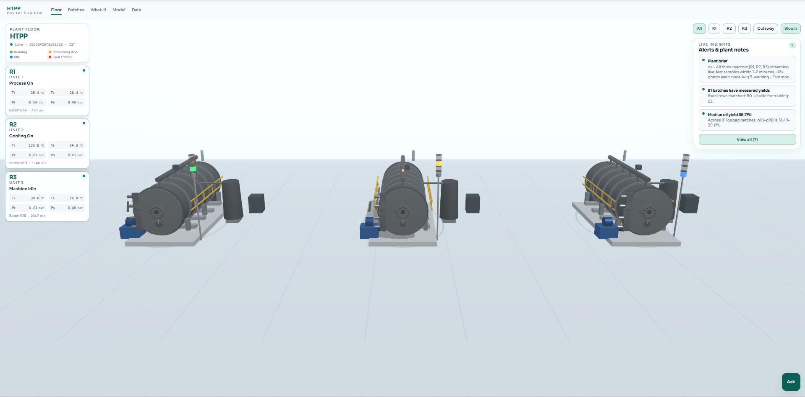
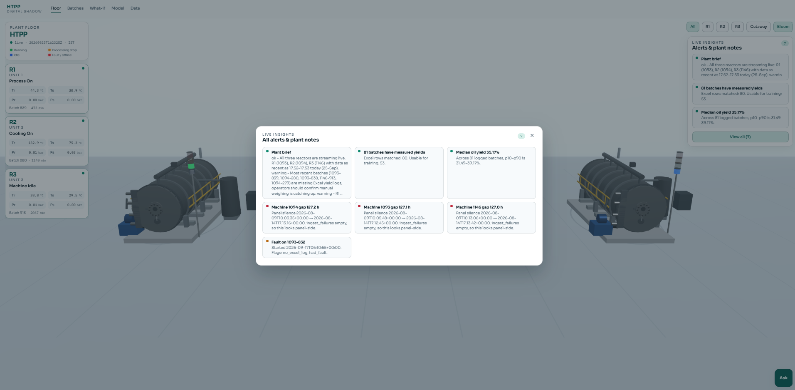
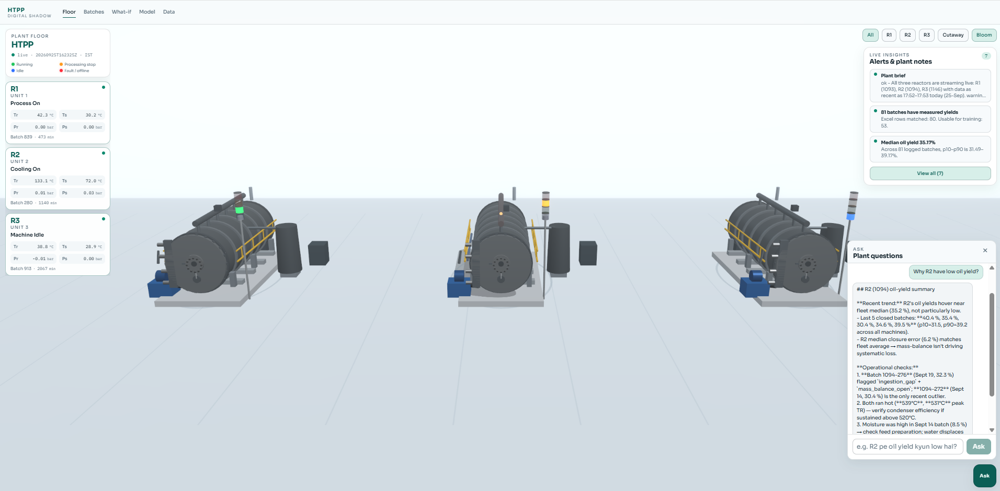
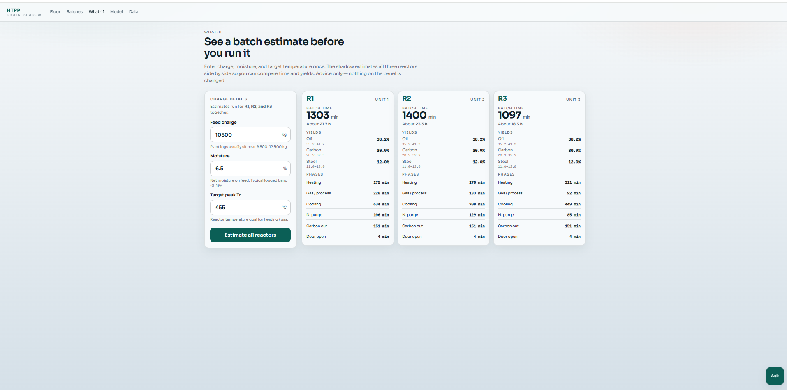
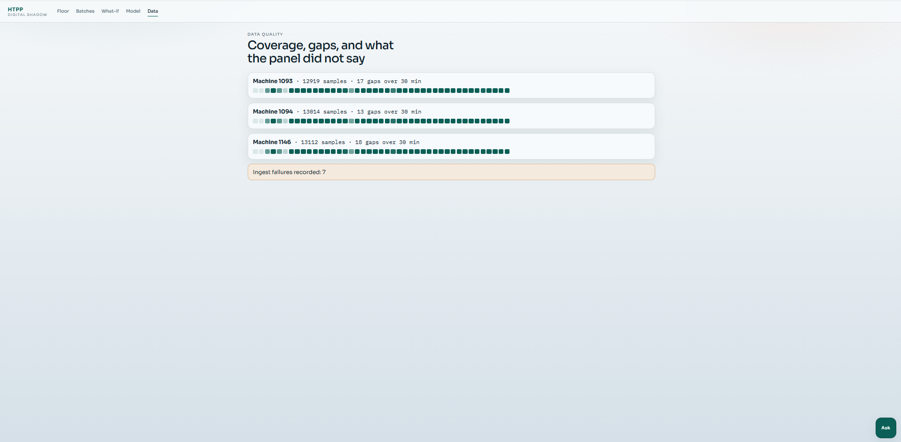

# HTPP Digital Shadow

Live **digital shadow** of industrial batch reactors: sparse PLC/panel telemetry → reduced-order models → 3D floor view, yield insights, and what-if simulation.

This is **not** a digital twin. Data flows one way (plant → software). The system never writes setpoints or actuates equipment.

| Floor (live) | Insights | Ask | What-if | Data quality |
|---|---|---|---|---|
|  |  |  |  |  |

---

## Research framing

- **Class:** digital *shadow* (Kritzinger et al., 2018) — automatic one-way coupling
- **Constraint:** ~4-minute industrial telemetry (not lab-dense signals)
- **Method:** reduced-order thermal / phase models + yield estimates with intervals
- **Ops layer:** live 3D scene, coverage/gap audit, operator Q&A over plant data only

---

## What you get

| Area | Description |
|------|-------------|
| **Floor** | Live 3D reactors with status tower lights and process cards |
| **Insights** | Plain-language alerts (gaps, yields, faults) + optional AI plant brief |
| **Ask** | Full-screen Q&A over shadow data (read-only) |
| **What-if** | Side-by-side R1/R2/R3 estimates for charge / moisture / peak Tr |
| **Batches / Data** | History and telemetry coverage |

---

## Telemetry from the panel (PLC / sensors)

Samples arrive roughly every **4 minutes**. Field meanings:

| Field | Unit | Meaning |
|-------|------|---------|
| `tr_c` | °C | Reactor temperature |
| `ts_c` | °C | Separator temperature |
| `pr_bar` | bar | Reactor pressure |
| `ps_bar` | bar | Separator pressure |
| `roh_c_per_min` | °C/min | Rate of heating |
| `amb_temp_c` | °C | Ambient temperature |
| `process_raw` | text | Panel process label (e.g. heating, cooling, door open) |
| `fault_raw` | text | Panel fault label when present |
| `sampled_at` | timestamp | Sample time (stored UTC; UI shows IST) |
| `machine_id` | int | Reactor id (configured in `.env`) |
| `batch_no` | int | Panel batch number when known |

See [docs/TELEMETRY.md](docs/TELEMETRY.md) for formats and Excel mass-log columns.

---

## Quick start (local)

```powershell
cd htpp-digital-twin
python -m pip install -e "./backend[dev]"
copy .env.example .env
# fill panel credentials and optional Anthropic keys — never commit .env

cd frontend
npm install
cd ..

$env:PYTHONPATH = "backend/src"
python -m htpp.cli seed
python -m htpp.cli fit
python -m htpp.cli api
```

Second terminal:

```powershell
cd frontend
npm run dev
```

Open http://localhost:3000

---

## Configuration

All secrets and site labels live in **`.env`** (see `.env.example`):

- Panel username / password / base URL
- Machine ids and **display labels** (`HTPP_MACHINE_LABELS`)
- Excel reactor-name aliases (`HTPP_MACHINE_ALIASES`) — match your workbook text
- Anthropic key / workspace (optional Ask assistant)
- CORS + public API/WS URLs for the frontend

Customer or site names must **not** be hardcoded in source. Put them only in `.env` or `column_map.local.yaml` (gitignored).

---

## Deploy (recommended)

**Vercel-only (demo + Ask):** set Root Directory to `frontend`. Same-origin `/api` serves demo plant data and Claude. See **[docs/DEPLOY.md](docs/DEPLOY.md)**.

Optional later: a Python host (Render / Railway / Fly) for live PLC + DuckDB fitted models. Not required for the public demo UI.

---

## Repo hygiene

- `.env` is gitignored — rotate any key that was ever pasted into chat or screenshots
- Plant Excel files stay out of git (`*.xlsx` ignored except test fixtures)
- Specs under `docs/` are the deeper contracts; start with this README + `TELEMETRY.md`
- See [docs/SECURITY.md](docs/SECURITY.md) before any public push

---

## License / data use

Panel credentials belong to the plant operator. Use read-only access, respect rate limits, and obtain written data-use consent before publication or wide sharing.
